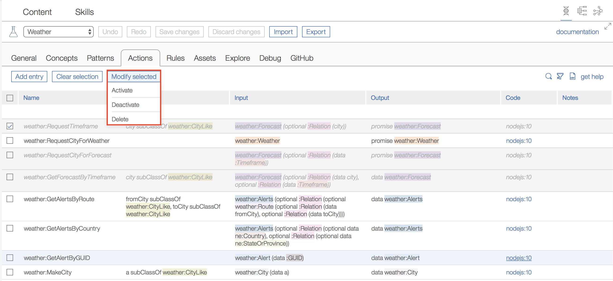

We are glad to announce a new control to EBA dev lab--fine grained component activation and deactivation. Following our last release which allowed developers to deactivate entire agents, developers can now deactivate particular components within an agent. We found that this feature is integral to active development and experimentation within EBA. Concepts, actions, assets, endpoints, etc. can now all be controlled in a more developer friendly way when debugging certain reasoning and execution flows within EBA. The example below shows a case where are all actions producing data for `weather:Forecast` are deactivated.

As concepts form the basis for more complex components such as action and rules, we have ensured that deactivation of a given concept is propagated to other related components. In other words, disabling a concept will also disable any actions or rules which make use of this particular concept. 

As ontology is an interconnected set of relationships, we have also introduced the notion of _partially active_ concepts. These are concepts which contain a predicate which is deactivated. Partially active concepts are simply meant to signify that the concepts themselves are still active, but some underlying relationship is deactivated. The example below shows a case where the predicate `weather:Alerts isListOf weather:Alert` is deactivated. 

