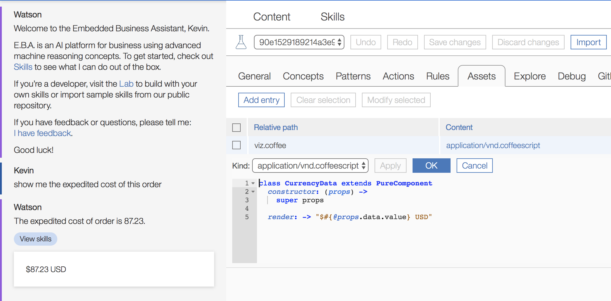

## Superclass rendering pipeline

We are excited to announce a new change to EBA's rendering pipeline--superclass evaluation. This superclass evaluation provides a mechanism for visualizing concepts using a hierarchical priority system, giving developers more power in the selection of UI visualizers.

Since EBA concepts are well formed and often contain subclass ontology relationships, we have decided to leverage this existing knowledge to provide a priority system when deciding which React component to use in visualizing a particular concept. This priority system is based on a _superclass_ hierarchy of the target concept. A superclass here denotes the hierarchy of concepts which a particular concept derives from, including the concept itself. The superclass is represented as an ordered list. For instance, if `:SalesOrder` subClasses from `:Order` and `:Showable`, the superclass produced is [`:SalesOrder`, `:Order`, `:Showable`]. From here our system determines which React component to invoke. It will first look for the component for `:SalesOrder`. If the component does not exist, then it will look for `:Order`, and, so on. This opens the door to customize and alter existing visualization pipelines. For instance, you can render all types of orders using a single component, or you can assert priority to a given visualization. In certain cases where there is divergence in terms of which component to use, EBA will apply to component which has less ontological relationships, as more specific or custom classes are generally less used through the system. For instance, if the component `:ChangeRateValue` subclasses from both `:NumAttribute` and `:PercentAttribute`, the system will naturally give priority to `:PercentAttribute` as it is a more specific and less frequent subclass within our system.

### Some use cases to consider

You can consider a case where you have some custom data type, such as a percent value associated with your domain, e.g. open rate. In standard practice, `:OpenRate` is considered a numerical attribute which subclasses from `:NumAttribute`. However, in its native implementation, the visualizer associated with `:NumAttribute` simply renders the value as is. You may wish to render this value in a custom way, e.g. with a percentage sign. This attribute and all like attributes can subclass from, say, `:PercentegeValue`. You can now render all these concepts in a custom fashion.

Below is an example of a numeric value which represents a `:Currency` value. It can be more appropriately visualized by explicity representing the currency (USD). 

